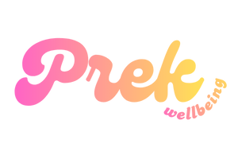

<p align="center">
  
</p>

<h1 align="center">2025-Prek</h1>

<div align="center">
  
[](https://flutter.dev/)
[](https://dart.dev/)
[](https://supabase.io)
[](https://www.postgresql.org/)
[](https://www.docker.com/)
[](https://aws.amazon.com/)
[](https://github.com/features/actions)

</div>

## Contents
- [Project description](#project-description)
- [Stakeholders](#stakeholders)
- [User Stories](#user-stories)
- [Project Structure](#project-structure)
- [Tech Stack](#tech-stack)
- [Architecture Diagram](#architecture-diagram)
- [User Instructions](#user-instructions)
- [Developer Instructions](#developer-instructions)
- [Internal Links](#internal-links)
- [Team Members](#team-members)

## Project Description  
**Prek** is a wellbeing application designed to help users cultivate mindfulness and positivity through guided reflection exercises. 
The application encourages users to focus on gratitude and intentional living by providing structured daily prompts and journaling features that promote positive thinking and emotional balance.   

The **goal** of Prek is to create a simple, reflective, and uplifting digital space that helps users cultivate gratitude, mindfulness, and intentional living. By providing structured prompts and seamless journaling features, the project aims to empower users to recognise positive moments, manage stress, and enhance their sense of wellbeing over time. 

**Main functionality**:
- Providing different affirmations every day
- Write daily reflections
- View past entries

## Stakeholders
- **Individual Client**: The project owner who will oversee the general direction of the app and receive the final deliverables.

- **End Users**: The individuals seeking to enhance their mindfulness and general wellbeing by daily reflection and gratitude.

- **Student Team**: The group of programmers and designers responsible for designing and developing the application.

## User Stories
**As a University Student,**

- I want a quick way to record what I’m grateful for after lectures so that I can keep a positive mindset and handle academic stress better.
  
- I want my gratitude entries linked to specific days or classes so that I can see which parts of my routine affect my well-being.

**As a Busy Professional,**

- I want short daily prompts that guide my gratitude reflections so that I can practice mindfulness without adding extra effort to my schedule.
  
- I want to log my mood alongside my gratitude entries so that I can notice patterns that influence my focus and work-life balance.

**As Someone Working on Their Mental Health,**

- I want to review my past gratitude entries so that I can see how far I’ve come and stay motivated on harder days.

- I want to see simple trends or highlights from my entries so that I can better understand what contributes to my happiness.

  
## Releases

| Release        | Description                                               | Target Date | Status  |
|----------------|-----------------------------------------------------------|--------------|----------|
| **MVP**         | Core functionality for initial launch.                    | 20/11/2025   | Completed  |
| **Beta**        | Majority of functionality implemented.                    | 19/02/2026   | Completed  |
| **Final Release** | Full functionality and optimizations; ready for production. | 30/04/2026   | Completed  |

## Project Structure
```
2025-Prek
├─ .github/
│  ├─ workflows/     # CI / CD pipelines (Flutter checks, tests, etc.)
│  └─ PULL_REQUEST_TEMPLATE.md
├─ docs/minutes      # Documentation and meeting minutes
├─ prek-app          # Project root with all source code
├─ AI Tools.md       # AI usage disclosure and coverage
├─ CONTRIBUTING.md   # Contribution guidelines and development workflow
├─ ETHICS.md         # Ethical considerations and responsible design
├─ LICENSE           # Project license (MIT)
└─ README.md         # Project overview and setup instructions
```

## Tech Stack  
- **Frontend** : Flutter
- **Backend**  : Supabase
- **Database** : PostgreSQL
  
## Architecture Diagram


## User Instructions
1. Login
    - Enter your email and password then click Login.
    
2. Sign Up
   - Click the Sign Up button if you are a new user.
   - Enter your username
   - Enter your email.
   - Enter your password twice for verification process.
   - Click the Sign Up button and your account will be created.

3. Forgot Password
   - Click the Forgot Password button if you have forgotten your password.
   - Enter your email.
   - There will be a Reset Password link sent to your email if you are a registered user.
   - After updating your password, log in again.
    
4. Home Page
   - Once logged in, you will see a new affirmation everyday.
   - Click the Start Reflection button to write your reflection.
   - Access the History Page, Profile Page, Lookbook Page and Settings Page by clicking the icon in the menu bar at the bottom.

5. Reflection Page
   - Choose an emoji on how you feel today.
   - Choose to write a reflection, record a reflection or upload a picture to the lookbook.
   - Click Save Reflection to link it to the History Page or Lookbook Page.
     
6. History Page
   - Your past text and voice reflections will show up here with timestamps and moods.
     
7. Profile Page
   - View your username, email and streaks here.
   - View your previous moods in a calendar view here.

8. Lookbook Page
   - Your past picture reflections will show up here with captions.
     
9. Settings Page
   - Change your name, email and password in this page.
   - Click save and your information will be updated.
   - Click the button on the top right corner to switch to dark mode or light mode.
   - Click the logout button to logout. 

## Developer Instructions
1. Install [Flutter](https://docs.flutter.dev/install/manual)
2. In the terminal, clone this repository:
   
   ```
   git clone https://github.com/spe-uob/2025-Prek.git
   ```
3. In the terminal, install dependencies at the project root:

    ```
     flutter pub get
    ```
4. In the terminal, run the application:
   
   ```
   flutter run
   ```
   
## Internal Links
- [Kanban Board](https://github.com/orgs/spe-uob/projects/342)
- [License](https://github.com/spe-uob/2025-Prek/blob/a588db8ce4e40b9cb71dcd3317db70c8fcda09c1/LICENSE)
- [Ethics](https://github.com/spe-uob/2025-Prek/blob/dev/ETHICS.md)
- [AI document](https://github.com/spe-uob/2025-Prek/blob/dev/AI%20Tools.md)
- [Contributing](https://github.com/spe-uob/2025-Prek/blob/dev/CONTRIBUTING.md)
  
## Team Members 

| Members        | Email                |
|----------------|----------------------|
| Carol Tan      |pn24594@bristol.ac.uk |
| Daud Ismail    |kk24104@bristol.ac.uk |
| Layan Alaskar (Client Liaison)  |pk23085@bristol.ac.uk |
| Ziqian Zhang   |ni24790@bristol.ac.uk |
| Kylan Zou      |gn23627@bristol.ac.uk |

| Week        | Project Manager      |
|-------------|----------------------|
| 2-7         |Layan Alaskar         |
| 8-12        |Daud Ismail           |
|13-18        |Carol Tan             |
|19-24        |Ziqian Zhang          |
